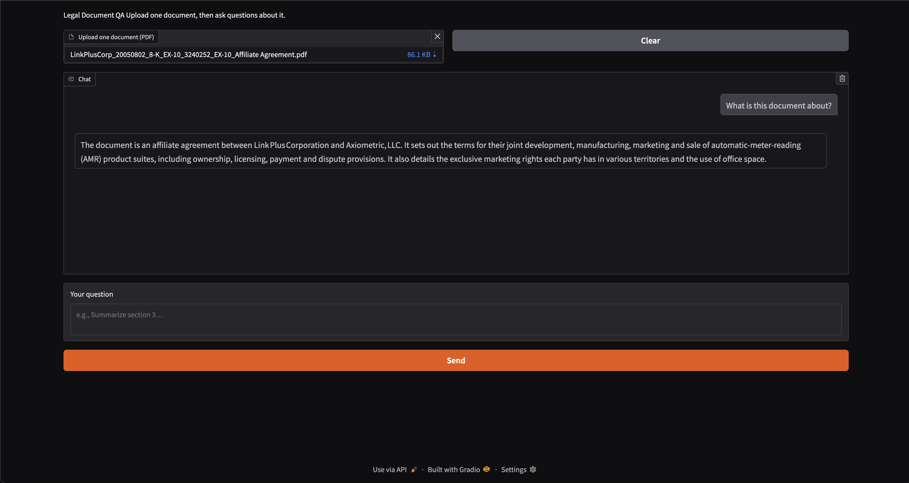

# 📑 Legal Document RAG Chatbot  

This project implements a **Retrieval-Augmented Generation (RAG)** pipeline for **legal document question-answering** using [LangChain](https://www.langchain.com/), [HuggingFace embeddings](https://huggingface.co/sentence-transformers), [FAISS](https://faiss.ai/), and [Gradio](https://gradio.app/) for the UI.  

The system allows a user to:  
1. Upload a **PDF document** (legal agreements, contracts, etc.).  
2. Store it into a **vector database** using FAISS with transformer embeddings.  
3. **Ask natural language questions** about the uploaded content.  
4. Get concise, context-grounded answers powered by a **large language model (LLM)** (Groq API).  

---

## ⚙️ Features  

- **Document Ingestion**  
  - Upload individual PDF files or process an entire folder.  
  - Extracts text using `PyPDFLoader`.  

- **Chunking Strategies**  
  - Length-based (`CharacterTextSplitter`)  
  - Recursive hierarchical (`RecursiveCharacterTextSplitter`)  
  - Semantic (`SemanticChunker` with embeddings)  
  - Token-based (`SentenceTransformersTokenTextSplitter`)  

- **Vector Database**  
  - Embeddings created using `sentence-transformers/all-mpnet-base-v2`.  
  - Stored and queried with FAISS.  
  - Support for incremental updates (`addNewFiletoVectorDB`).  

- **Hybrid Retrieval**  
  - Combines **dense retrieval (FAISS)** with **sparse retrieval (BM25)**.  
  - Ensemble retriever balances semantic and keyword search.  

- **Retrieval-Augmented Generation (RAG)**  
  - Prompts an LLM (via Groq API).  
  - Context-aware answers limited to 3 sentences.  
  - Configurable alternative prompts for structured/legal reasoning.  

- **Interactive UI**  
  - Built with Gradio.  
  - Upload documents, ask questions, and view chat history.  
  - Reset/Clear functionality.  

---

## 🛠️ Tech Stack  

- **LangChain** → Orchestration of document loading, chunking, retrieval, and QA.  
- **HuggingFace Embeddings** → Vector representation of text.  
- **FAISS** → Vector database for semantic search.  
- **BM25Retriever** → Sparse keyword search.  
- **Groq LLM** → Backend language model for generating answers.  
- **Gradio** → Lightweight frontend interface for interaction.  
- **dotenv** → Manage API keys securely.  

---

## Output Image

   

## To run the app

1. Clone the repository:

    `git clone `

2. Make sure that you fulfill all the requirements: Python 3.11 or later with all [requirements.txt]() dependencies installed, . To install, run:

    `pip install -r requirements.txt`

3. After installing all the packages from requirements. Run the [legalRAG.py]().

    `python legalRAG.py`

